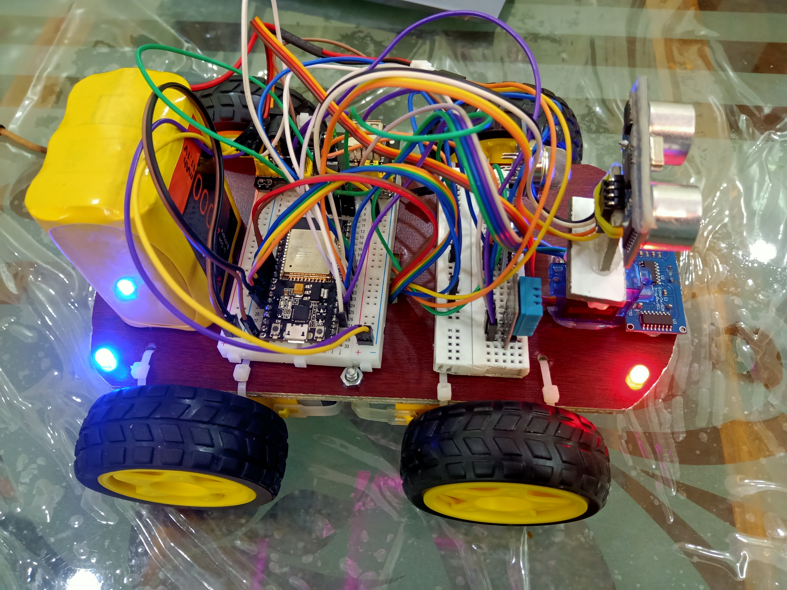
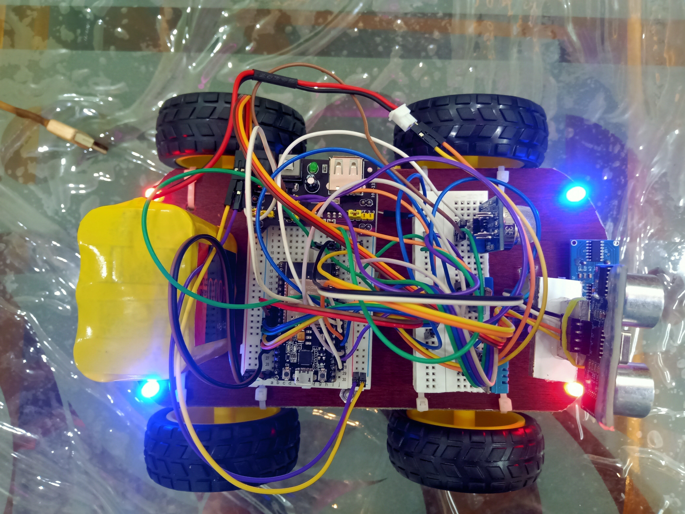
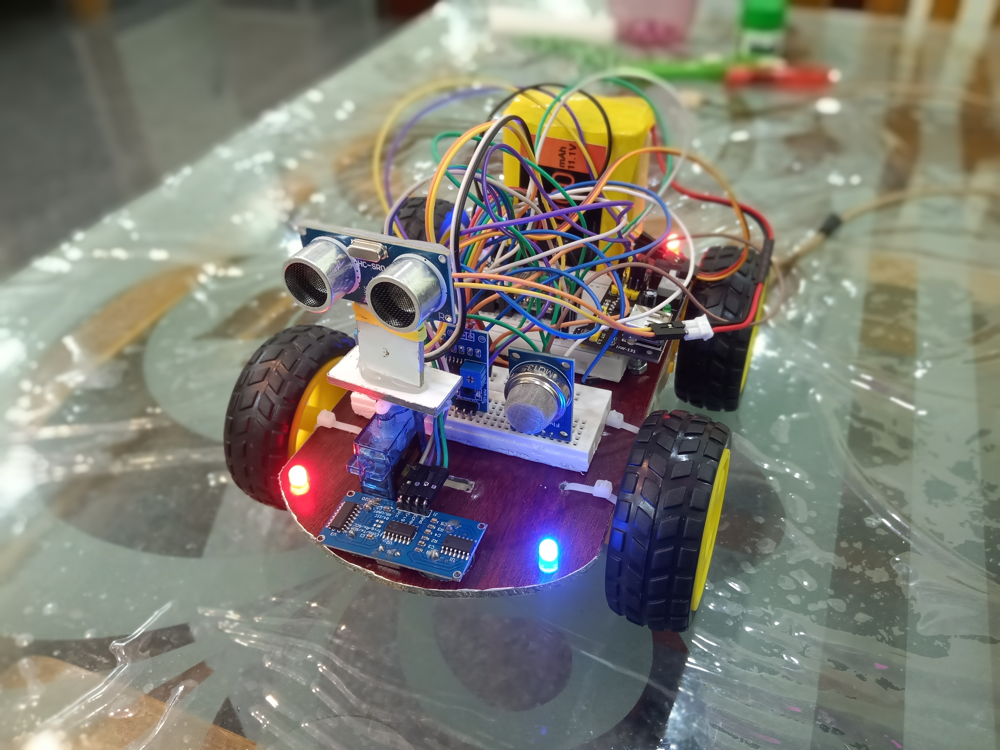
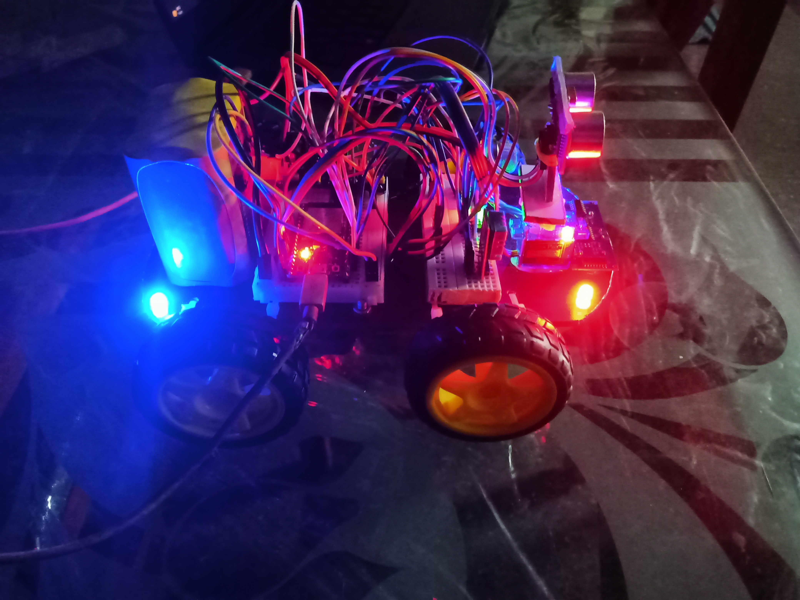

# ExploRover-IOT

ExploroRover, a groundbreaking project that converges robotics, surveillance, and environmental monitoring into a single, dynamic entity. In the realm of exploration and surveillance, this device stands as a testament to innovation, offering a harmonious blend of mobility, user control, and environmental awareness. Picture a rover that not only moves with purpose but captures its journey in real-time, granting users the ability to navigate and explore remote locations manually. Beyond its mobility finesse, ExploroRover incorporates advanced obstacle avoidance mechanisms, ensuring seamless traversal through diverse terrains. 
Its multifaceted role as a mobile surveillance system. Equipped with high-quality video capture capabilities, it serves as a vigilant eye in real-time, capturing and relaying the visual essence of its surroundings. But it doesn't stop there ExploroRover is not just a witness; it's an analyst. Integrated temperature and moisture sensors provide a comprehensive environmental snapshot, elevating its utility for applications ranging from security to environmental monitoring. Join us in sculpting a device that redefines exploration, seamlessly intertwining mobility, control, and environmental intelligence into the fabric of modern innovation.

<b> Objective of the project: </b><br>
<li>The primary objectives of the ExploroRover are Mobility and Control, Real-Time Video Capture, Obstacle Avoidance and Environmental Monitoring under one platform.</li>
<li>The user can Integrate or collect the Data remotely.</li>
<br>
Preferences 🔗 <br>

```js
https://espressif.github.io/arduino-esp32/package_esp32_index.json
```

[support]: https://caniuse.com/#feat=custom-elementsv1
[polyfill]: https://github.com/webcomponents/polyfills/tree/master/packages/custom-elements


<br>
<h4 style="color:red;"> Images</h4>





